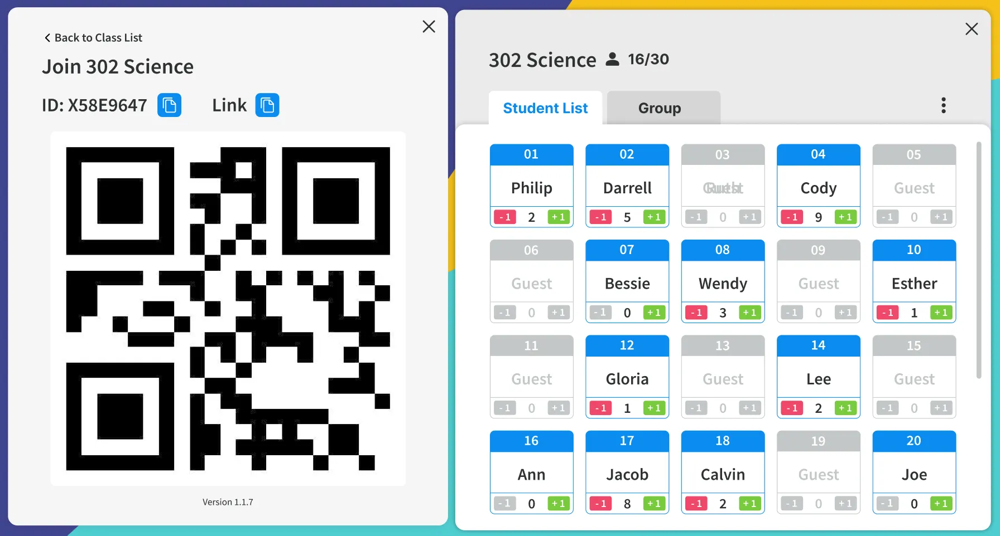

# 📌 React 挑戰 - 在 10 小時內完成一個功能

#### ⏳ **挑戰時長**：10 小時  
#### 🎯 **目標**：在 10 小時內，構建一個 React Web 應用並實現指定功能。  
#### 📂 **提交內容**：一個包含完整代碼的 GitHub 倉庫。


## 📜 挑戰描述
> 💡 **場景**：你是某個創業公司的前端開發人員，產品團隊希望你快速搭建一個新功能的原型。
你需要在 **10 小時內**，使用 **React** 構建一個 Web 應用，並實現核心功能。這次挑戰將考察你的 **React 組件結構設計**、**狀態管理**、**資料獲取** 和 **交互處理能力**。


## 🛠 需求事項




1. 畫面儘可能一樣即可 （RWD, 或等比縮放都可以）
2. 請使用 Typescript
3. 請 Fetch API 回傳資料，自行設計 API Response Data 給這個畫面 （需 fetch api 在程式碼內）
4. QR Code 掃瞄後前往 https://www.classswift.viewsonic.io/ 
5. 需有複製功能
6. Tab 切換
    1. Student List
    2. Group (五個一組，隨意設計)
7. 按 … 可以跳出 **Menu（**隨意設計)
8. 按 + - 有對應作用，不必儲存資料
9. X 關閉該畫面，重整後出現原畫面


## ⚙️ Technical Skills

你可以使用以下技術來完成挑戰：
- **Frontend Tech**：React（使用 Vite 或 Create React App）
- **State management**：Context API、Zustand、Redux Toolkit
- **UI Library**：Tailwind CSS、Material UI、Chakra UI
- **Fetch**：Fetch API、Axios、React Query
- **Router（可選）**：React Router
- **Test（可選）**：Jest、React Testing Library、Cypress
- **Deploy（可選）**：Vercel、Netlify


## 🚀 安裝依賴
   ```sh
   - install
   pnpm install
   
   - run dev
   pnpm dev